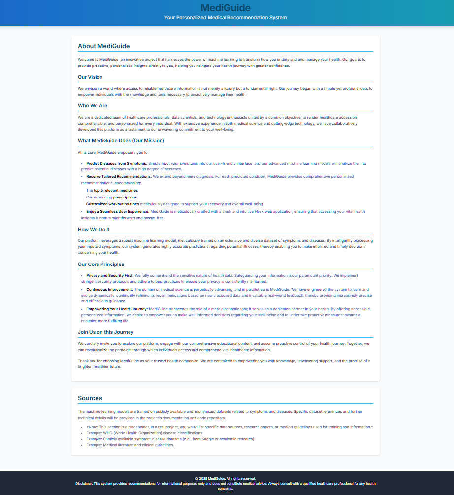
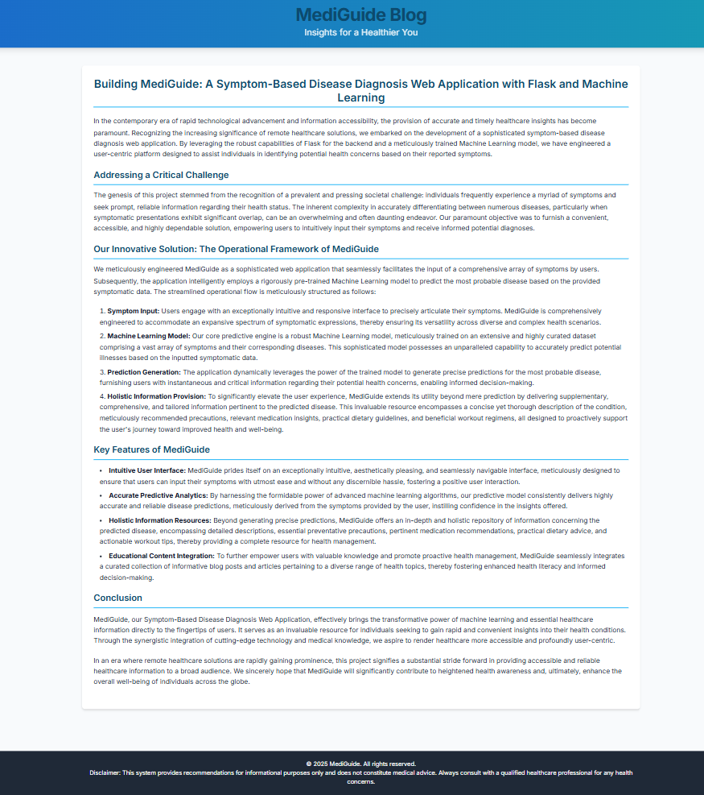
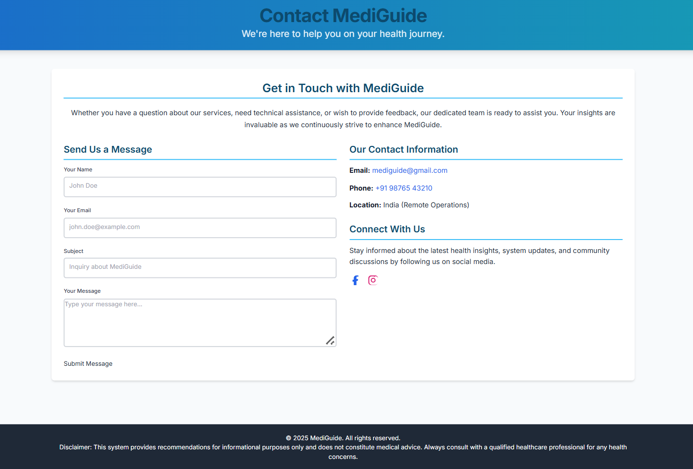
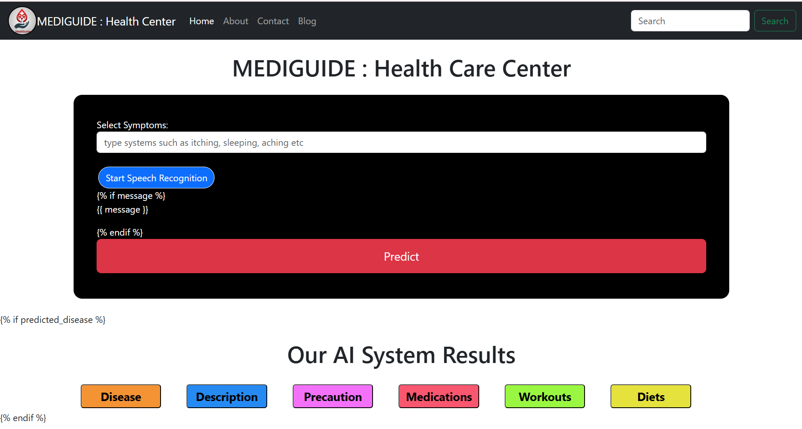

⚕️ MediGuide: Your Personalized Medical Recommendation System 💊
Welcome to MediGuide, an innovative project that harnesses the power of machine learning to transform how you understand and manage your health. Our goal is to provide proactive, personalized insights directly to you, helping you navigate your health journey with greater confidence.

💡 What MediGuide Does
At its core, MediGuide empowers you to:

Predict Diseases from Symptoms: Simply input your symptoms into our user-friendly interface, and our machine learning models will analyze them to predict potential diseases with a high degree of accuracy.

Receive Tailored Recommendations: We go beyond just diagnosis. For each predicted condition, MediGuide provides personalized recommendations, including:

💊 The top 5 relevant medicines.

📝 Corresponding prescriptions.

🏋️‍♀️ Customized workout routines designed to support your recovery and overall well-being.

Enjoy a Seamless User Experience: MediGuide is built with a sleek and intuitive Flask web application, ensuring that accessing your health insights is straightforward and hassle-free.

📸 MediGuide in Action
See MediGuide's intuitive interface and powerful recommendations:

🎯 Our Core Principles
Privacy and Security First: We understand the sensitive nature of health data. Protecting your information is our top priority. We employ robust security measures to ensure your privacy is always maintained.

Continuous Improvement: The field of medicine is constantly evolving, and so is MediGuide. We've designed it to learn and improve over time, continually refining its recommendations based on new data and real-world feedback to provide increasingly accurate and effective guidance.

Empowering Your Health Journey: MediGuide isn't just a diagnostic tool; it's a partner in your health. By providing accessible, personalized information, we aim to empower you to make informed decisions about your well-being and take proactive steps towards a healthier life.

🛠️ Technologies Used
Backend:

Python: Core programming language.

Flask: Lightweight web framework for the application server.

Scikit-learn: Machine learning library for model development.

ML Model: SVM (SVC), pre-trained on symptom-disease mappings, stored as svc.pkl.

Frontend:

HTML: For structuring the web pages.

CSS: For styling and layout.

JavaScript: For interactive elements and dynamic content.

Data:

CSV datasets: Used for training the ML model, containing symptoms, medications, and workout routines.

Version Control: GitHub

🚀 Getting Started (Local Setup)
To run MediGuide on your local machine, follow these steps:

Clone the Repository:

Bash

git clone https://github.com/ShrutiparnaRoy/Medicine_Recommendation
cd Medicine_Recommendation
Create a Virtual Environment (Recommended):

Bash

python -m venv venv
# On Windows:
.\venv\Scripts\activate
# On macOS/Linux:
source venv/bin/activate
Install Dependencies:

Bash

pip install -r requirements.txt
If requirements.txt is missing, you can generate one after installing all necessary libraries with pip freeze > requirements.txt.

Run the Flask Application:

Bash

python main.py

🌐 The Deployment Challenge: Global Accessibility & Performance
A critical goal for MediGuide is to make it a globally accessible application that works seamlessly across various platforms while upholding our core principles of privacy and performance. This involves addressing several complex challenges:

Cross-Platform Compatibility: Ensuring a consistent and functional experience on:

🖥️ Desktop (Linux, Windows, macOS)

📱 Mobile (Android, iOS)

Consistent User Experience (UX): Maintaining an intuitive and familiar interface regardless of the device or operating system.

Secure Health Data Handling: Implementing robust security measures for data in transit and at rest, complying with privacy standards (e.g., GDPR, HIPAA principles where applicable).

Scalability for Global Users: Designing the infrastructure to efficiently handle a large and growing user base worldwide without performance degradation.

Offline Functionality: Exploring solutions to provide basic functionality or cached data for users in areas with poor or no internet connectivity.

